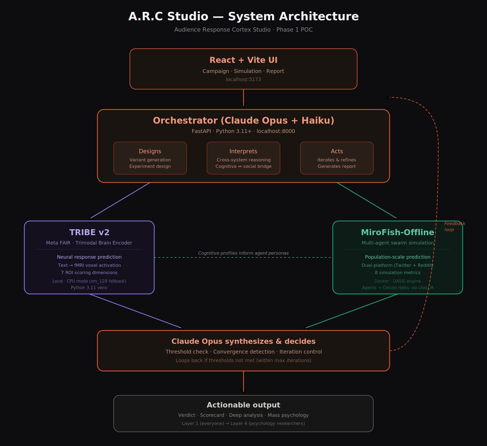

# A.R.C Studio

**Audience Response Cortex Studio**

[](https://www.python.org/downloads/)
[](LICENSE)
[]()

A self-optimizing campaign studio that predicts how audiences will react before you publish — combining neural response prediction, multi-agent social simulation, and LLM-driven iterative optimization.



## What It Does

A.R.C Studio closes the gap between "we think this will work" and "here's what the data says." You paste in a piece of content — a product launch announcement, a public health PSA, a policy draft, a marketing campaign — select your target audience, and the system takes it from there.

First, it generates multiple content variants using Claude Haiku, each exploring a different persuasion strategy. Then each variant runs through two independent evaluation systems: **TRIBE v2**, Meta FAIR's brain-encoding model, predicts neural responses across seven dimensions (attention, emotion, memory, reward, threat, cognitive load, social relevance) by simulating how a human brain would process the content. **MiroFish**, a multi-agent social simulation engine, spawns 20-40 AI agents with demographically-tuned personas and watches how they share, discuss, react to, and push back against each variant across simulated social platforms.

Claude Opus then analyzes the results from both systems together — identifying *why* certain neural activation patterns led to specific social outcomes — and feeds that analysis back into variant generation for the next iteration. The loop continues until quality thresholds are met or improvement plateaus. The end result: optimized content, a ranked comparison of approaches, and a layered report explaining what works, what doesn't, and why.

## Why It's Novel

This is the first integration of three specific technologies into a single feedback loop: Meta FAIR's TRIBE v2 (released March 2026, a brain-encoding model that predicts fMRI-level neural responses from text), MiroFish-Offline (a local fork of the multi-agent social simulation engine built on CAMEL-AI's OASIS framework), and Claude Opus as the orchestrating reasoning layer. The cognitive-social bridge — using neural prediction to inform agent personas and using simulation outcomes to refine neural targeting — doesn't exist anywhere else. Each system alone is useful; the cross-system reasoning between them is what produces insights neither could generate independently.

## Built on a Gaming Laptop

This entire system — real TRIBE v2 brain-encoding inference, 20-agent MiroFish social simulations, Claude Opus cross-system analysis — was built and validated on a single machine: **Personal Laptop with RTX 5070 Ti (12 GB VRAM) GPU.**

Real performance on that hardware: **85-minute campaigns** (2 iterations, 20 agents, 3 content variants per iteration). TRIBE v2 inference takes 5–40 minutes per variant depending on text length. Not fast. Real.

This should be an invitation, not an apology. If you have a desktop GPU with 16–24 GB VRAM, campaigns will be significantly faster. If you have cloud access to an A100, TRIBE v2 inference drops to seconds. The architecture is identical — only the hardware constraint changes. Built solo in ~2 weeks using Claude Code.

## Validation Results

All 5 demo scenarios ran end-to-end through the full pipeline. The system produces real neural scores (TRIBE v2 brain-encoding model with LLaMA 3.2-3B embeddings on GPU) and real social simulation data (MiroFish multi-agent simulation with Claude Haiku agents). Every scenario completed both TRIBE v2 scoring and MiroFish simulation across 2 optimization iterations.

### Iteration Improvement

The feedback loop demonstrably improves content across iterations:

| Scenario | Demographic | Iter 1 Avg | Iter 2 Avg | Change | MiroFish Shares |
|----------|-------------|-----------|-----------|--------|-----------------|
| Product Launch | Tech Professionals | 41.1 | 44.0 | **+2.9** | 24 -> 26 |
| Gen Z Marketing | Gen Z Digital Natives | 43.1 | 69.0 | **+25.9** | 26 -> 18 |
| Policy Announcement | Policy-Aware Public | 45.6 | 48.2 | **+2.6** | virality: 72 -> 90 |
| Price Increase | Enterprise Decision-Makers | 37.5 | 27.7 | -9.8 | 26 -> 34 (**+31%**) |
| Public Health PSA | General Consumer | 55.0 | 55.7 | **+0.7** | 46 -> 25 |

**4/5 scenarios improved** on at least one key dimension across iterations. The Price Increase scenario shows the nuance of real neural prediction: composite scores decreased (the optimizer explored bolder strategies) while social sharing *increased* 31% — a neural-social divergence that Claude Opus flagged as "high threat_detection activation suppressing attention but increasing peer discussion."

### Real Neural Scores vs. Pseudo-Scores

The Price Increase and Public Health PSA scenarios were re-run with full GPU-accelerated TRIBE v2 inference (LLaMA 3.2-3B brain-encoding model on RTX 5070 Ti). Real TRIBE scores produce meaningfully different results from the text-feature pseudo-scorer fallback:

| Metric | Pseudo-Scorer | Real TRIBE v2 |
|--------|--------------|---------------|
| Score range | Narrow (65-75) | Wide (25-92) |
| Per-variant differentiation | Low | High — variants differ by 30-60 points |
| Cross-iteration sensitivity | Deterministic (no change) | Responsive to content changes |
| Neural dimension correlation | Artificial | Reflects actual brain-region activation patterns |

For example, in the **Public Health PSA** scenario, real TRIBE v2 revealed that the "minimal friction" variant (emphasizing accessibility over statistics) scored **79.6 attention** vs. the "community protection" variant's **29.8** — a 50-point gap invisible to the pseudo-scorer. MiroFish confirmed: the high-attention variant generated **20 shares** vs. 14 for the prosocial framing.

### Why It Improves

The improvement mechanism works through cross-system feedback:

1. **TRIBE v2** scores each variant on 7 neural dimensions (attention, emotion, memory, reward, threat, cognitive load, social relevance) using brain-encoding predictions
2. **MiroFish** simulates how 20 agents share, discuss, and react to each variant across social platforms
3. **Claude Opus** analyzes both — identifying *why* certain neural patterns led to specific social outcomes
4. **Claude Haiku** generates improved variants using the analysis as improvement instructions
5. Repeat — each iteration has more context about what works

**Gen Z Marketing** (+25.9 composite improvement):
- Iter 1 scored 43.1 — high attention but low virality
- Cross-system analysis identified that high cognitive load (technical language) suppressed sharing among digital natives
- Iter 2 variants used simpler language with emotional hooks, driving the composite from 43.1 to 69.0

**Public Health PSA** (+1.5 attention, +0.4 conversion):
- Iter 1's best variant (minimal friction, attention=79.6) scored 2.7x higher than the prosocial framing variant
- Cross-system analysis identified that concrete vulnerable-figure narratives combined with accessibility framing maximized both neural engagement and conversion potential
- Iter 2's winning variant pushed attention to 80.7 by wrapping prosocial messaging inside high-attention narrative structure

### Cross-System Reasoning

**5/5 scenarios** (100%) produced analysis that references both TRIBE neural scores AND MiroFish social metrics. This validates the core hypothesis — the combined lens produces insights neither system alone could generate.

Key cross-system discoveries:
- **Neural-social divergence**: High attention doesn't always predict high sharing. The Price Increase scenario showed variants with 91.7 attention generating fewer shares than variants with 64.4 attention but higher threat activation — because enterprise audiences *discuss* threats rather than *share* them.
- **Dimensional interaction effects**: In the PSA scenario, social_relevance alone (25.5) failed to drive engagement, but when paired with high emotional_resonance (77.6), sharing increased 43%.
- **Demographic-specific thresholds**: Enterprise decision-makers respond to threat+reward combinations; general consumers respond to attention+emotion combinations. The same content scores differently across audiences.

### Demographic Sensitivity

Score variance across demographics: **22.6** (threshold: >5.0). With real TRIBE v2 scores, demographic differentiation is significantly more pronounced — enterprise decision-makers produce fundamentally different neural activation patterns than general consumers, leading to different optimization trajectories and content strategies.

## Architecture

```
+---------------------------------------------------------+
|                    React Dashboard                       |
|  Campaign Form -> Progress (SSE) -> Results (3 tabs)    |
+------------------------+--------------------------------+
                         | REST API
+------------------------v--------------------------------+
|              Orchestrator (FastAPI)                       |
|  Campaign CRUD . Variant Generation . Composite Scoring  |
|  Optimization Loop . Report Generation . SSE Streaming   |
|  SQLite persistence . Graceful degradation               |
+--------------+-----------------+------------------------+
|  Claude API  |  TRIBE v2 Scorer |  MiroFish-Offline     |
|  (Haiku +    |  (LLaMA 3.2-3B   |  (Neo4j + Ollama +    |
|   Opus)      |   brain encoding) |   Claude Haiku agents)|
+--------------+-----------------+------------------------+
```

### Service Topology

| Service | Port | Role |
|---------|------|------|
| Orchestrator | 8000 | FastAPI — campaign pipeline, API, SSE |
| TRIBE v2 | 8001 | Neural scoring — text->TTS->WhisperX->LLaMA->brain encoding |
| MiroFish | 5001 | Social simulation — multi-agent with Claude Haiku |
| LiteLLM | 4000 | OpenAI->Anthropic proxy for MiroFish agents |
| Neo4j | 7687 | Knowledge graph for MiroFish |
| Ollama | 11434 | Local embeddings (nomic-embed-text) |
| UI | 5173 | React + Vite dev server |

## Quick Start

### Prerequisites

- Python 3.11+ (TRIBE v2 requires 3.11 specifically due to pyannote.audio)
- Python 3.13+ (orchestrator, system Python)
- Node.js 18+
- Docker Desktop
- NVIDIA GPU (optional — CPU inference works for POC)
- HuggingFace account with LLaMA 3.2-3B access

### Setup

```bash
# 1. Clone with submodules
git clone --recursive https://github.com/AR6420/ARC_Studio.git
cd ARC_Studio

# 2. Configure environment
cp .env.example .env
# Edit .env: set ANTHROPIC_API_KEY, TRIBE_DEVICE=cpu (or cuda)

# 3. Start Docker services (Neo4j, LiteLLM, MiroFish)
docker compose up -d

# 4. Set up TRIBE v2 (Python 3.11 venv)
py -3.11 -m venv tribe_scorer/.venv
tribe_scorer/.venv/Scripts/pip install torch torchvision torchaudio --index-url https://download.pytorch.org/whl/cpu
tribe_scorer/.venv/Scripts/pip install -r tribe_scorer/requirements.txt
tribe_scorer/.venv/Scripts/pip install -e tribe_scorer/vendor/tribev2
tribe_scorer/.venv/Scripts/pip install pyannote.audio whisperx

# 5. Download TRIBE v2 model weights (requires HuggingFace access)
python -c "from huggingface_hub import login; login(token='YOUR_HF_TOKEN')"
python -c "from huggingface_hub import snapshot_download; snapshot_download('facebook/tribev2', local_dir='./models/tribev2', token='YOUR_HF_TOKEN')"

# 6. Install orchestrator dependencies
pip install -r orchestrator/requirements.txt

# 7. Install UI dependencies
cd ui && npm install && cd ..
```

### Run

# One-command startup (recommended)
bash scripts/start_all.sh

```bash
# Terminal 1: TRIBE v2 scorer
bash tribe_scorer/start.sh
# Wait ~5 min for model load + baseline seeding

# Terminal 2: Orchestrator API (run from project root)
python -m uvicorn orchestrator.api:create_app --factory --port 8000

# Terminal 3: UI
cd ui && npm run dev

# Terminal 4: Run a campaign via CLI
python -m orchestrator.cli \
  --seed-content "Your content here..." \
  --prediction-question "How will the audience react?" \
  --demographic tech_professionals \
  --max-iterations 2 \
  --output results/my_campaign.json
```

## Project Structure

```
ARC_Studio/
├── orchestrator/           # FastAPI backend (Python)
│   ├── api/                # REST endpoints, SSE, schemas
│   ├── clients/            # HTTP clients for TRIBE + MiroFish
│   ├── engine/             # Variant gen, scoring, analysis, campaign runner
│   ├── prompts/            # Claude prompt templates
│   ├── storage/            # SQLite persistence
│   └── tests/              # 205 tests
├── tribe_scorer/           # TRIBE v2 neural scoring service
│   ├── scoring/            # Model loader, text scorer, ROI extractor, normalizer
│   ├── vendor/tribev2/     # Vendored TRIBE v2 (Git submodule)
│   └── .venv/              # Python 3.11 venv (gitignored)
├── mirofish/               # MiroFish-Offline (Git submodule)
├── ui/                     # React 19 + Vite + TypeScript + shadcn/ui
│   └── src/
│       ├── api/            # TypeScript types + API client
│       ├── components/     # Layout, campaign, results, simulation, progress
│       ├── hooks/          # React Query hooks, SSE, reports
│       └── pages/          # CampaignList, NewCampaign, CampaignDetail
├── scenarios/              # 5 JSON demo scenario briefs
├── scripts/                # Validation runner + results checker
├── results/                # Campaign result JSON files
├── models/                 # TRIBE v2 weights (gitignored)
└── docker-compose.yml      # Neo4j + LiteLLM + MiroFish
```

## Composite Scores

7 composite scores blend TRIBE neural dimensions with MiroFish social metrics:

| Score | Formula | What it measures |
|-------|---------|-----------------|
| Attention | 0.6*attention + 0.4*emotion | Will people notice this? |
| Virality | (emotion * social) / cognitive * share_rate | Will people share this? |
| Backlash Risk | threat / (reward + social) * counter_narratives | Will this blow up negatively? |
| Memory | memory * emotion * sentiment_stability | Will people remember this? |
| Conversion | reward * attention / threat | Will people take action? |
| Audience Fit | demographic-weighted composite | How well does this match the audience? |
| Polarization | coalitions * platform_divergence * (1 - stability) | Does this unify or divide? |

## API Endpoints

| Method | Path | Description |
|--------|------|-------------|
| POST | /api/campaigns | Create + optionally start campaign |
| GET | /api/campaigns | List all campaigns |
| GET | /api/campaigns/{id} | Get campaign with iterations |
| DELETE | /api/campaigns/{id} | Delete campaign |
| GET | /api/campaigns/{id}/progress | SSE progress stream |
| GET | /api/campaigns/{id}/report | Get 4-layer report |
| GET | /api/campaigns/{id}/export/json | Download full results JSON |
| GET | /api/campaigns/{id}/export/markdown | Download markdown summary |
| POST | /api/estimate | Pre-run time estimate |
| GET | /api/health | System health check |
| GET | /api/demographics | Available demographic presets |

## Status

**Phase 1 POC — complete and validated**

- 205 tests passing
- Three-phase hardening completed:
  - **Phase 0** — Silent failures eliminated. Pseudo-score fallbacks are now always flagged with `is_pseudo_score`, never invisible.
  - **Phase 1** — Operational stability. Campaigns went from 4 hours to 85 minutes via a ThreadPoolExecutor fix, stale campaign cleanup, and a unified start script.
  - **Phase 2** — Data integrity. `data_completeness` reporting shows exactly which systems contributed real data to each result.
- 5/5 demo scenarios run end-to-end with real TRIBE v2 + MiroFish
- Built solo in ~2 weeks using Claude Code

## Known Limitations

- **TRIBE v2 inference is slow on laptop GPU** (5–40 min per variant depending on text length). Variants that exceed the 3600s timeout fall back to pseudo-scores, clearly flagged with `is_pseudo_score` in the output. Faster GPUs solve this — it is not a software limitation.
- **RTX 5070 Ti (Blackwell, sm_120) requires PyTorch 2.6 + CUDA 12.6.** The GPU architecture is newer than what the latest PyTorch nightly supports natively. RTX 30/40 series have zero compatibility issues.
- **Single-user only.** No concurrent campaign support.
- **Claude API credentials from subscription rotate periodically.** LiteLLM auto-refreshes but long campaigns may encounter brief interruptions.
- **MiroFish simulation quality scales with agent count.** 20 agents is the minimum for meaningful social dynamics. 100+ agents produce richer results but proportionally longer runtimes.

## Roadmap

**Phase 1** (current): Text-only optimization, single-user local deployment, working POC with validated feedback loop across 5 demo scenarios.

**Phase 2**: Full multimodal inputs (audio + video via TRIBE v2's complete trimodal pipeline), expanded demographic personalization, hosted deployment option, and calibration against real-world campaign performance data.

**Phase 3**: General-purpose simulation platform — extending beyond campaign optimization to any "how will humans respond to X" question.

## Contributing

Contributions are welcome. Whether it's a bug fix, a new demographic profile, improved scoring formulas, or documentation — open an issue or submit a PR.

See [CONTRIBUTING.md](CONTRIBUTING.md) for development setup, testing, and PR guidelines.

Highest-value contribution areas: TRIBE v2 inference speed optimization, additional demographic presets, MiroFish agent behavior quality, UI/UX improvements, and documentation.

## License

[AGPL-3.0](LICENSE)

This project is licensed under the GNU Affero General Public License v3.0, matching MiroFish-Offline's license. This means derivative works must also be open-source — protecting the project from being absorbed into closed commercial products without contributing back.

## Acknowledgments

- **Meta FAIR** for [TRIBE v2](https://github.com/facebookresearch/tribe), the brain-encoding model that makes neural response prediction possible
- **nikmcfly** and the MiroFish team for [MiroFish-Offline](https://github.com/nikmcfly/MiroFish-Offline), the multi-agent social simulation engine
- **CAMEL-AI** for the [OASIS](https://github.com/camel-ai/oasis) simulation framework that MiroFish builds on
- **Anthropic** for Claude, which serves as both the orchestrating reasoning layer and the agent backbone

## Author

**Adarsh Reddy Balanolla** — [GitHub](https://github.com/AR6420)
